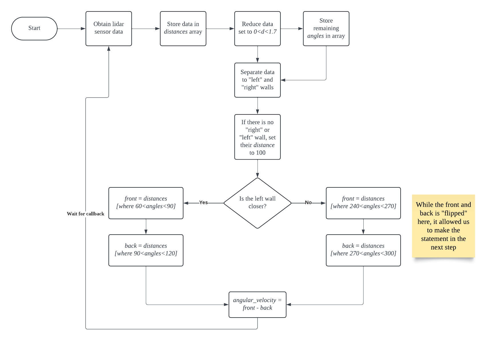

<!--  DELETE THE LINES ABOVE THIS AND WRITE YOUR PROJECT README BELOW -->

# Comprobo Warmup Project
*ENGR3590: A Computational Introduction to Robotics*

*Christopher Nie*\
*Charlie Mawn*

The goal of this project is to familiarize ourselves with Ros2, the interface between Python and the Neato\
that we will be using throughout this course. This project first started with simple drive commands using \
the publisher `cmd_vel`, and eventually introduced perception and proportional control. The primary sensors\
used in this project are the built-in lidar and bump sensor. These are the final behaviors programmed into\
our Neato. \

- Teleoperation
- Driving a Square
- Wall Follower
- People Follower 
- Obstacle Avoider
- Finite-State Controller

## Teleoperation

### Methods
This module allows a person to manually remote control a robot through a wireless connection. Our teleoperation\
catches user input as long as the user is in the terminal that is running the ros2 file. The Neato accepts the\
following input: \

- W: Forward
- A: Rotate Counterclockwise 
- S: Rotate Clockwise
- D: Backward
- X: STOP

### Code Structure
In order to implement this behavior, we used a package that tells python what key is being pressed. From this we published a message to the `cmd_vel` topic, which the robot picks up and sets the velocities of the wheels accordingly


## Driving a Square

### Methods

This module drives the Neato to draw a predefined shape. We chose to draw a square. This module uses an \
open loop controller where the robot performs tasks based on a predefined tasklist, without taking active \
feedback from sensors. We judged that this controller was sufficient for this portion of the project. However,\
This was also our first exposure to the Neato's margin of error. Although it ran successfully in the simulation, \
the real world Neato had to contend with multiple factors such as friction and inertia. Therefore, we had to\
perform some minor tuning to adapt the code to the real world. Although the user was not able to interact much\
with the robot in this module, one direction we could have explored was letting the user decide the shape that \
the Neato would draw.

### Code Structure
In order to implement the drive square behavior, we used the time package, which tells us the current time as well as the time since we started the program. This means that we are able to tell the robot (via the `cmd_vel` topic) the amount of time to move for. We set the wheels to move forward for a set amount of time, then turn for the set amount of time repeatedly. 

## Wall Follower

[Wall Follower Demo Video](https://youtube.com/shorts/JPt8uSnMzNA?feature=share) 
[Wall Follower Visualization Video]()
This module was our first exposure to utilizing the lidar sensor. This is one of the more powerful perception tools \
available to the Neato. The Neato returns its Lidar content through the topic `/scan` in a `LaserScan` type message. \
`LaserScan.ranges` returns the distances of each degree in an array with length `361`. We store this in a `numpy.array` \
object called `distances`, and create a separate `numpy.array` object called `angles`. Next, we filter out any `distances` \
and `angles` that are greater than `0` and less than `1.7` to reduce noise. 

We then sort the remaining `distances` and `angles` into the **left wall** and **right wall**. We compare the average \
distance to both walls. This allows the Neato to determine which wall to follow. We decided that the callback function \
will only manipulate angular velocity to steer the Neato at a constant linear velocity of `0.1`. In order to calculate \
the angular velocity, the Neato compares the average distance of the wall before it to the average distance of the wall behind \
it. The angular velocity is simply 
```Python
self.angular_vel = mean(front) - mean(back)
```
If the average distance of the front is greater, than it will turn counterclockwise. Otherwise, it will turn clockwise.\
We initially had trouble coding this part due to our intuition telling us that "left" was negative and "right" was \
positive. This also swapped the "left wall" and "right wall", which overall meant that this was a debuggin nightmare. \
From this, we took a lesson of testing early and more frequently, as well being more efficient with `print()` statements\
in debugging projects.  



We also decided to add some level of user interaction. The user controls are similar to the `teleop` module.

- W: Forward (Wall Following ON)
- A: Rotate Counterclockwise (Wall Following OFF)
- S: Rotate clockwise (Wall Following OFF)
- A: Backwards (Wall Following OFF)

This allows the user to manually move the Neato, and allowed us to test the Neato without physically moving the Neato \
However, the user needs to confirm the input with an `enter`. The algorithm that `Wall follower` uses requires \
non-blocking user input. Unfortunately, we were unable to provide that with our intial `teleop` module. Thus, we used \
multi-threading with the default Python `input()` to achieve a non-blocking variation of `teleop`. 

## Person Follower
### Description
For person following, the robot scans the area, and navigates towards the nearest object "person"

[Person Follower Demo Video](https://youtube.com/shorts/jJg8_n1pfGM?feature=share)
[Rviz2 Visualization Video](https://youtu.be/syYlnzwFbQY)

### Methods
To achieve person following behavior, we first had to make a few assumptions. Firstly, we assume the only thing in range of the robot is the person. So, any walls, or objects in the room are assumed to not be "in range" of the robot. We also assume that the "person" is actually one point around the center of the legs. 

In implementation, we first take a LIDAR scan, and filter out the values we dont want. This includes any values that come back as infinity (mostly for simulation), any ranges that are negative (suprisingly happens sometimes), any ranges that are 0, and most importantly, any ranges that are over 1 meter away from the robot. This insures that any values picked up from distance walls and objects dont influence the robot behavior. 

We then use the remaining scans, which should ideally only include the person, and calculate an average value of the scan. This gives us a place to tell the robot to go towards. With this averaged value, we used trigonometry to calculate the difference in angle of the current robot heading, and the heading it should be at to face the person. 

We then use this 'item error' to proportionally control the robot's speed when following the person. If the angle it needs to turn is very large, it will move very fast. If the angle is very small, it will not only turn slowly, but it will also move forward while turning. This can be seen in the demo video, how the robot will stop moving forward, and only turn when the angle between the person and the robot is large. 

### Code Structure
The `person_follower.py` file contains a `PersonFollowerNode` which controls the person following behavior of this robot. Within the `PersonFollowerNode` there is a publisher, sending messages on the `cmd_vel` topic to the robot, telling it what velocities to set the wheels at. This class also contains a subscriber, listing to the `scan` topic, and recieving LIDAR scan information from the robot. There is also a publisher used in publishing to the `marker` topic, which was useful in visualizing and debugging the node. 

## Obstacle Avoidance

[Obstacle Avoidance Demo Video](https://youtube.com/shorts/1Yyr_hemj-g?feature=share)
please note that the visualization in RViz for this behavior broke, and another visualization was unable to be obtained

Obstacle avoider adapted our `Wall followe` algorithm to work with front facing walls. Similar to `Wall follower`, the \
raw `LaserScan.ranges` data is stored into a `numpy.array` object called `distances`, with a parallel `numpy.array` called \
`angles` created to store the corresponding angles. This time, we filter out any `distances` greater than `0.8`. Thus, the \
Neato can only "see" objects within a 0.8 meter radius circle. The remaining `distances` and `angles` are sorted into the \
**left bounds** and **right bounds** array. This allows for the angular velocity simply to be
```Python
self.angular_vel = sum(right_bounds) - sum(left_bounds)
```
Unlike `Wall follower`, we use `sum()` here because we want to choose the direction with the least amount of points. If there \
are fewer `left_bound` points, then that means the `left_bound` might be an edge. Mathematically, `left_bounds` will be much \
smaller than `right_bounds`, which will sum to a more positive `self.angular_vel`. Thus, it will turn counterclockwise, or \
towards the left side, which is potentially an edge. 

However, this simple subtraction has a shortcoming. When `sum(right_bounds)` is very close to `sum(left_bounds)`, then \
`self.angular_vel` will be close to `0`. In other words, if the Neato is directly facing a wall, the angular velocity \
will be very small. This case is captured with  
```Python
if mean(left_bounds) - mean(right_bounds) < 0.1:
    self.angular_velocity = 2.0
    self.linear_velocity_scale = 0.4
```
This statement changes the angle such that we can continue to use the first statement. We use `foo2 - foo1 < 0.1` instead of `==` \
to prevent this statement from triggering when there are no values in `left_bounds` and `right_bounds`. This case occurs when \
there are no obstacles in front at all. Thus, `self.angular_vel=0` is appropriate. 

So far, we have written the code to allow the Neato to move without hitting any obstacles. However, we have yet to include the notion \
of a "preferred direction of motion." At first, we struggled with the definition of a "preferred direction of motion." Is it a single \
point, as implied by the idea of potential fields? Or is it just a direction vector? We ultimately settled on the latter. 

To achieve the preferred direction of motion, 

Use encoder to store history

## Finite State Controller

[Finite State Controller Demo Video](https://youtube.com/shorts/Fp6Xx75TFZ0?feature=share)

### Methods

For the finite state controller, we decided to build a behavior based on the person following behavior already shown above. We build the node so that it exhibits person following behavior until the bump sensor is activated. Upon bumping, the robot switched to a mode which we call "dizzy". In dizzy mode, the robot spins in a circle quite fast. Upon bumping again, the mode switched back to person following. 

### Code Structure

In order to exhibit person following and dizzy behaviors, we had to create a new attribute called `self.state`. On every bump event, we switch the state from spinning to following. While this node was implemented much more simply than others, it is built upon the person follower node.

## Conclusion

### Challenges
Throughout the course of this project, there were many challenges we faced. One of the code-induced challenges were making the keyboard input work without stopping other events from being read. Another challenege was the conceptual mathmatical implementation of person tracking and wall tracking. Both of these challenges stumped us for some time, but through trial and error, we were able to create a program that we were both happy with. 
### Improvements
Given more time, we would have implemented a few more things. For example, the finite state controller was initially planned on being a wall/person following combo. We wanted to use the lidar scans to differentiate walls and people. With this, we could have the robot follow walls until a person was seen, then follow the person. Due to time restraints, we had to scrap this idea. We also would have liked to create a more in depth documentation of our code, but time restricted us to only noting the key points. 
### Take-aways
We believe that the biggest take away of this project is how powerful ROS is. Before this project, we had almost zero experience with ROS, but through the course of this project, we have been able to understand the problem solving capabilities of it, and how powerful the "publisher" and "subscriber" idea of robot control is. 

