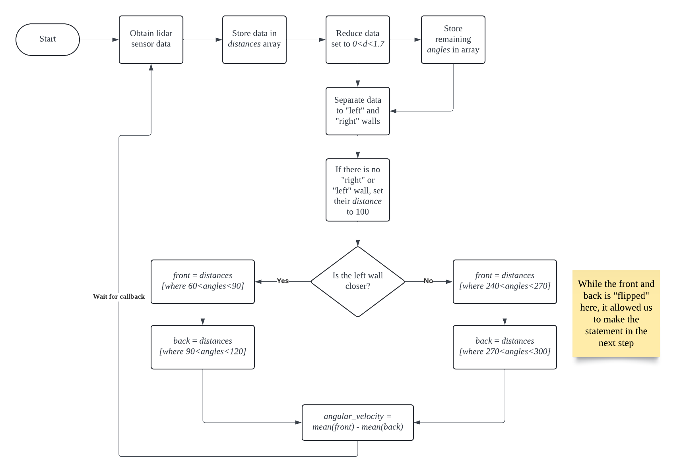

## Wall Follower

This module was our first exposure to utilizing the lidar sensor. This is one of the more powerful perception tools \
available to the Neato. The Neato returns its Lidar content through the topic `/scan` in a `LaserScan` type message. \
`LaserScan.ranges` returns the distances of each degree in an array with length `361`. We store this in a `numpy.array` \
object called `distances`, and create a separate `numpy.array` object called `angles`. Next, we filter out any `distances` \
and `angles` that are greater than `0` and less than `1.7` to reduce noise. 

We then sort the remaining `distances` and `angles` into the **left wall** and **right wall**. We compare the average \
distance to both walls. This allows the Neato to determine which wall to follow. We decided that the callback function \
will only manipulate angular velocity to steer the Neato at a constant linear velocity of `0.1`. In order to calculate \
the angular velocity, the Neato compares the average distance of the wall before it to the average distance of the wall behind \
it. The angular velocity is simply 
```
self.angular_vel = front - back
```
If the average distance of the front is greater, than it will turn counterclockwise. Otherwise, it will turn clockwise.\
We initially had trouble coding this part due to our intuition telling us that "left" was negative and "right" was \
positive. This also swapped the "left wall" and "right wall", which overall meant that this was a debuggin nightmare. \
From this, we took a lesson of testing early and more frequently, as well being more efficient with `print()` statements\
in debugging projects.  



We also decided to add some level of user interaction. The user controls are similar to the `teleop` module.

- W: Forward (Wall Following ON)
- A: Rotate Counterclockwise (Wall Following OFF)
- S: Rotate clockwise (Wall Following OFF)
- A: Backwards (Wall Following OFF)

This allows the user to manually move the Neato, and allowed us to test the Neato without physically moving the Neato \
However, the user needs to confirm the input with an `enter`. The algorithm that `Wall follower` uses requires \
non-blocking user input. Unfortunately, we were unable to provide that with our intial `teleop` module. Thus, we used \
multi-threading with the default Python `input()` to achieve a non-blocking variation of `teleop`. 

## Obstacle-Avoider

