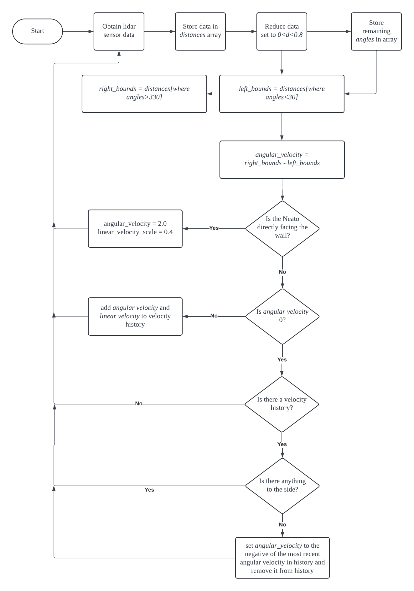

## Wall Follower

This module was our first exposure to utilizing the lidar sensor. This is one of the more powerful perception tools \
available to the Neato. The Neato returns its Lidar content through the topic `/scan` in a `LaserScan` type message. \
`LaserScan.ranges` returns the distances of each degree in an array with length `361`. We store this in a `numpy.array` \
object called `distances`, and create a separate `numpy.array` object called `angles`. Next, we filter out any `distances` \
and `angles` that are greater than `0` and less than `1.7` to reduce noise. 

We then sort the remaining `distances` and `angles` into the **left wall** and **right wall**. We compare the average \
distance to both walls. This allows the Neato to determine which wall to follow. We decided that the callback function \
will only manipulate angular velocity to steer the Neato at a constant linear velocity of `0.1`. In order to calculate \
the angular velocity, the Neato compares the average distance of the wall before it to the average distance of the wall behind \
it. The angular velocity is simply 
```Python
self.angular_vel = mean(front) - mean(back)
```
If the average distance of the front is greater, than it will turn counterclockwise. Otherwise, it will turn clockwise.\
We initially had trouble coding this part due to our intuition telling us that "left" was negative and "right" was \
positive. This also swapped the "left wall" and "right wall", which overall meant that this was a debuggin nightmare. \
From this, we took a lesson of testing early and more frequently, as well being more efficient with `print()` statements\
in debugging projects.  


We also decided to add some level of user interaction. The user controls are similar to the `teleop` module.

- W: Forward (Wall Following ON)
- A: Rotate Counterclockwise (Wall Following OFF)
- S: Rotate clockwise (Wall Following OFF)
- A: Backwards (Wall Following OFF)

This allows the user to manually move the Neato, and allowed us to test the Neato without physically moving the Neato \
However, the user needs to confirm the input with an `enter`. The algorithm that `Wall follower` uses requires \
non-blocking user input. Unfortunately, we were unable to provide that with our intial `teleop` module. Thus, we used \
multi-threading with the default Python `input()` to achieve a non-blocking variation of `teleop`. 

## Obstacle Avoider

Obstacle avoider adapted our `Wall followe` algorithm to work with front facing walls. Similar to `Wall follower`, the \
raw `LaserScan.ranges` data is stored into a `numpy.array` object called `distances`, with a parallel `numpy.array` called \
`angles` created to store the corresponding angles. This time, we filter out any `distances` greater than `0.8`. Thus, the \
Neato can only "see" objects within a 0.8 meter radius circle. The remaining `distances` and `angles` are sorted into the \
**left bounds** and **right bounds** array. This allows for the angular velocity simply to be
```Python
self.angular_vel = sum(right_bounds) - sum(left_bounds)
```
Unlike `Wall follower`, we use `sum()` here because we want to choose the direction with the least amount of points. If there \
are fewer `left_bound` points, then that means the `left_bound` might be an edge. Mathematically, `left_bounds` will be much \
smaller than `right_bounds`, which will sum to a more positive `self.angular_vel`. Thus, it will turn counterclockwise, or \
towards the left side, which is potentially an edge. 

However, this simple subtraction has a shortcoming. When `sum(right_bounds)` is very close to `sum(left_bounds)`, then \
`self.angular_vel` will be close to `0`. In other words, if the Neato is directly facing a wall, the angular velocity \
will be very small. This case is captured with  
```Python
if mean(left_bounds) - mean(right_bounds) < 0.1:
    self.angular_velocity = 2.0
    self.linear_velocity_scale = 0.4
```
This statement changes the angle such that we can continue to use the first statement. Additionally, we decided to slow down\
the linear velocity when the Neato is in such a position. For the conditional itself, we use `foo2 - foo1 < 0.1` instead of `==` \
to prevent this statement from triggering when there are no values in `left_bounds` and `right_bounds`. This case occurs when \
there are no obstacles in front of the Neato. In this case, `self.angular_vel=0` is appropriate. 

So far, we have written the code to allow the Neato to move without hitting any obstacles. However, we have yet to include the notion \
of a "preferred direction of motion." At first, we struggled with the definition of a "preferred direction of motion." Is it a single \
point, as implied by the idea of potential fields? Or is it just a direction vector? We ultimately settled on the latter. 

To achieve the preferred direction of motion, we stored the changes in angular velocity and linear velocity in a list whenever the angular\
velocity was not zero. When the Neato is travelling in a straight line, and it has completely passed the obstacle (determined by checking\
if there are obstacles to either side of the Neato), it will "undo" the angular velocities stored in the history until the list becomes `0`. 




Like the `Wall follower`, we decided to add user input using similar controls. 

- W: Forward (Obstacle Avoider ON)
- A: Rotate Counterclockwise (Obstacle Avoider OFF)
- S: Rotate clockwise (Obstacle Avoider OFF)
- A: Backwards (Obstacle Avoider OFF)

This allows the user to change the preferred direction of motion by resetting the angular and linear velocity lists. One way we would improve\
the obstacle avoider is by including the encoder to help store history. This increase both accuracy and robustness of the algorithm's ability\
to return back to a preferred direction of motion. 